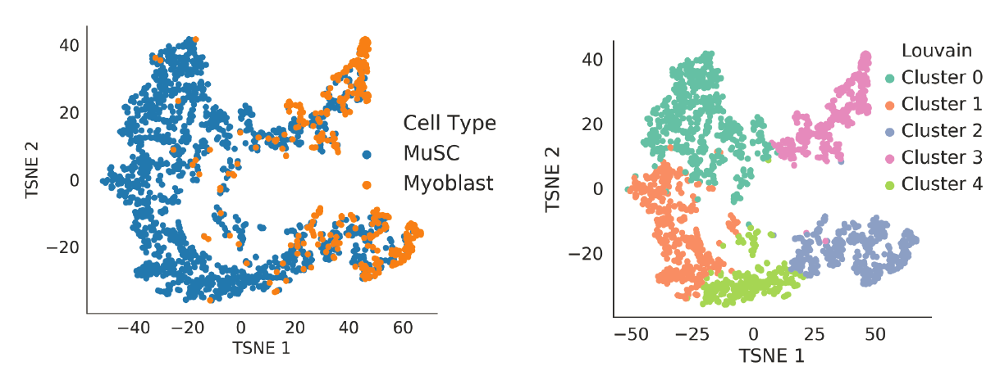

# Lanternfish

`Lanternfish` is a software tool to analyze cell motility data with recurrent neural networks (RNNs).`Lanternfish` includes RNN architectures suitable for classification, unsupervised embedding of cell motility into a latent space by autoencoding, and motion prediction.

We've published a pre-print applying `Lanternfish` in the context of myogenic activation and neoplastic transformation. [Check it out on bioRxiv](https://www.biorxiv.org/content/early/2018/02/09/159202) for in depth explanations and a demonstration of applications.

**Pre-print:** [Deep convolutional and recurrent neural networks for cell motility discrimination and prediction](https://www.biorxiv.org/content/early/2018/02/09/159202)

## Lanternfish Core Features

### RNN Architectures

Lanternfish contains four core RNN architectures: (1) a baseline LSTM classifier, (2) an LSTM classifier with convolutional feature extractors (a "convolutional RNN"), (3) an RNN autoencoder utilizing convolutional layers, and (4) an RNN autoencoder suitable for motion prediction.

Models are found in `bestiary.py`.

![Cell motility classification and autoencoder architecture schematics.
(A) A baseline RNN architecture, without convolutional feature extractors. (B)
RNN classification and (C) autoencoder architectures with convolutional feature
extractors, where \(k = i, j, ...\) is the number of parameterized kernels used
by each 1D convolutional layer in a series, and \(n = i, j, ...\) is the number
of nodes in a fully-connected layer or LSTM unit in a series.
Convolutional layers and paired with a rectified linear unit
activation. Pooling and upsampling layers operate with isotropic kernels of size
2 and stride of 2. Zero padding is performed as needed in autoencoder models to
match input size.](imgs/architectures.png)

### Cell Motility Classification

Motility classification models can be trained the CLI accessible via `lanternfish/main.py`.

### Cell Motility Latent Space Learning

A latent space embedding of cell motility samples can be learned in an unsupervised fashion using a `Lanternfish` autoencoder. These latent space embeddings may reveal interesting heterogeneity within cell populations. In an example experiment, we identified multiple distinct subpopulations of myogenic cells using this purely unsupervised latent space learning method.

Autoencoders can be trained and relevant latent spaces extracted using the CLI accessible at `lanternfish/main.py`.

### Cell Mimetic Simulations of Motion and Transfer Learning

`Lanternfish` contains tools to simulate motion that mimics a sample of heterogeneous motility behaviors, referred to as "cell mimesis". Sample motility behaviors are mimicked by decomposing the observed behavior into a set of *k* clusters based on displacement and directionality features, then simulating each of these clusters by fitting a Johnson distribution to displacement and turn angle observations within the cluster. Simulations are generated from each cluster proportional to their representation in the original sample.

Cell mimesis tools are found in `lanternfish/cell_mimesis.py`

### Cell Motility Prediction

`Lanternfish` includes RNN architectures for prediction of future cell motility behaviors based on past behaviors. These models learn to predict the subsequent steps in a cell's motility path from past steps, and demonstrate performance superior to linear models in muscle stem cells.

These models can be found in `lanternfish/bestiary.py`, and the linear baseline in `linear_pred.py`.

